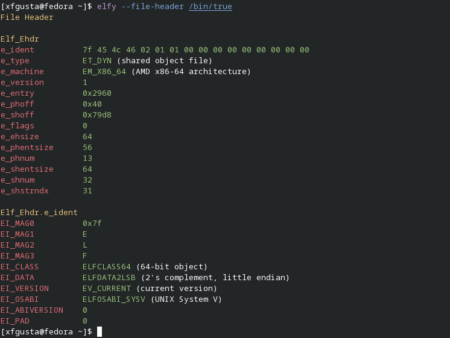

# elfy

A tool for displaying information about ELF files.

It currently support parsing the:

+ file header
+ program headers
+ section headers
+ dynamic section
+ symbol table
+ dynamic symbol table

Run `elfy --help` to print a description of the command-line options. I plan to add more options soon.

## Installation

### Arch Linux

Arch Linux users may use the AUR [elfy](https://aur.archlinux.org/packages/elfy)

```text
git clone https://aur.archlinux.org/elfy.git
cd elfy
makepkg -si
```

### Fedora Linux

Fedora Linux users may use the Copr [xfgusta/elfy](https://copr.fedorainfracloud.org/coprs/xfgusta/elfy/)

```text
dnf copr enable xfgusta/elfy
dnf install elfy
```

## Building from source

**Requirements**

+ make
+ gcc
+ libelf

```text
git clone https://github.com/xfgusta/elfy
cd elfy
make
```

## Screenshot


